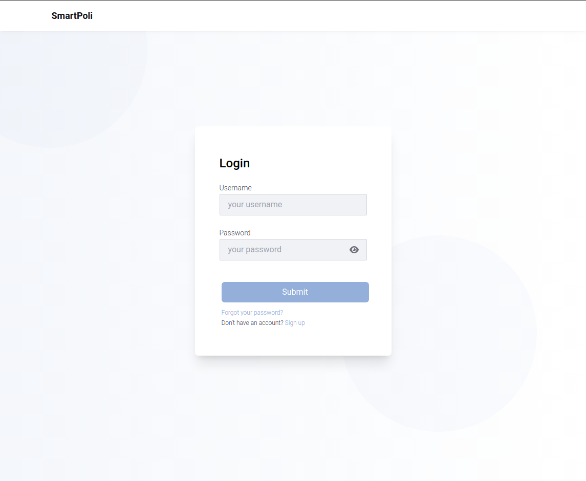

# Commercial Policies Engine

_Vue3, Nuxt3, Typescript, Nodejs, Mongodb, Docker and Tailwindcss_

This project was made using best practices and design patterns like BDD, Clean Architecture, DDD, DRY, Small Commits, SOLID principles and TDD.

If you wanna checkout the deployed version, click [here](https://smartpoli.netlify.app/). Unfortunately it's only the frontend, the backend is not yet deployed.

## Introduction

The Commercial Policies Engine is a system designed to manage business rules and commercial policies efficiently. By integrating and streamlining commercial policies related to payment terms, discounts, and other critical elements of interaction with customers and suppliers, this system aims to optimize time and processes within the commercial sector.

## Key Components

- ### Validation Parameters Registry:

  Comprises environment variables that the rules use for validation and reward release.
  The commercial team can edit these parameters, which can be of various types, including date, number, text, or a list of values.

- ### Commercial Rules Registry:

  Comprises only one parameter - the sales order in its entirety.
  The sales order includes customer information, items, user-selected fields, and other properties that influence the validation of the commercial rule.
  Allows for the creation of JavaScript codes with a mini IDE (such as Monaco), where the validation logic can be written for later execution when the recalculation of rewards is requested.

- ### Sales Order Object:

  Must be documented centrally with its properties and data types, ensuring everyone has access and can implement it in the satellite systems.
  The properties of the sales order may change over time based on tool development and usage needs.

- ### Third-Party Systems Integration:

  JavaScript code can request information from third-party systems such as obtaining a list of value ranges for discounts or validating based on billing history.
  These third-party systems must be prepared to receive SQL commands or adopt the REST standard for such requests.

- ### Function Injection by Dependency:

  Option to inject functions by dependency, where a function will be included within the sales order object.
  If the function is null, it will be possible to execute code within the Web API. If informed, the received function will be executed.

# Screenshots

